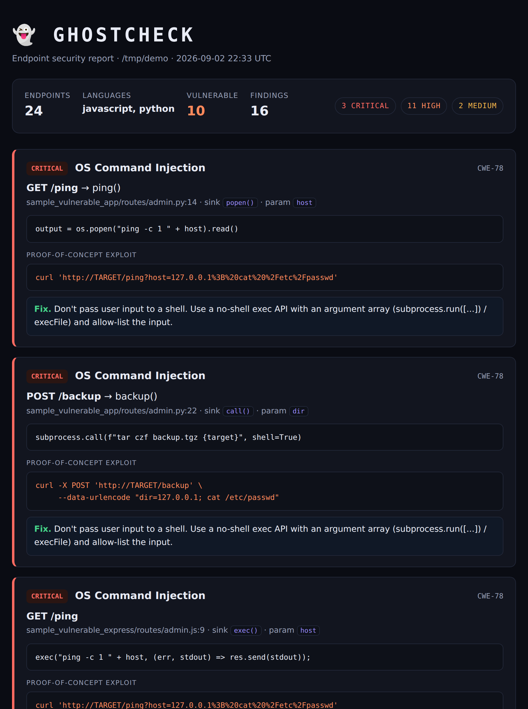

<div align="center">

<br/>

<picture>
  <source media="(prefers-color-scheme: dark)" srcset="https://img.icons8.com/sf-ultralight/100/FFFFFF/ghost.png">
  <source media="(prefers-color-scheme: light)" srcset="https://img.icons8.com/sf-ultralight/100/000000/ghost.png">
  
</picture>

# G H O S T C H E C K

### *The vulnerability you don't see — in the endpoint you forgot about.*

**A code-aware endpoint security scanner.** Point it at your app; it finds every HTTP endpoint, reads the handler that runs it, works out whether user input can reach a dangerous sink, and writes you a proof-of-concept exploit for each hole it finds.

<br/>

[](https://python.org/)
&nbsp;
[](https://tree-sitter.github.io/)
&nbsp;

&nbsp;


<br/>

</div>

---

## Why

Most scanners match request text against a list of bad patterns. They have **no idea what your code does** with the input, so they drown you in false positives (a scary-looking payload that your parameterised query handles just fine) and miss the real bugs (a boring-looking value that your code concatenates straight into a shell).

GhostCheck reads the **code**. For every endpoint it extracts the handler function, traces whether request input actually flows into a sink like `execute()` / `child_process.exec()` / `open()`, and only then reports — with the exact line and a working exploit. Parameterised queries and sanitised paths are recognised and left alone.

<div align="center">
<br/>

<br/>
<sub>One scan across a mixed Python + JavaScript codebase — every finding carries a proof-of-concept exploit and a fix.</sub>
<br/><br/>
</div>

---

## Install

```bash
# One-liner, straight from GitHub — no cloning, no PyPI needed:
pip install git+https://github.com/Kshitijmishradev/GhostCheck.git
```

Or from a clone:

```bash
git clone https://github.com/Kshitijmishradev/GhostCheck.git
cd GhostCheck
pip install -e .
```

Requires **Python 3.10+**. That's the only prerequisite — dependencies (tree-sitter + the language pack) install automatically.

---

## Use

```bash
ghostcheck scan ./path/to/your/app
```

Write reports and gate CI:

```bash
ghostcheck scan ./myapp --html report.html --json findings.json
ghostcheck scan ./myapp --fail-on HIGH        # exit non-zero if a HIGH+ issue exists
```

| Flag | Default | Meaning |
|:-----|:--------|:--------|
| `--html FILE` | – | write a standalone HTML report |
| `--json FILE` | – | write machine-readable findings |
| `--fail-on {CRITICAL,HIGH,MEDIUM,LOW,NONE}` | `HIGH` | exit code 1 when a finding at/above this level exists |
| `--no-color` | – | plain terminal output |

<details>
<summary><b>Sample terminal output</b></summary>

```
👻 GhostCheck — endpoint security scan
   target: ./myapp

  Endpoints discovered : 24  (11 javascript, 13 python)
  Vulnerable / clean   : 10 / 14
  Findings             : 3 CRITICAL  11 HIGH  2 MEDIUM

   CRITICAL OS Command Injection  CWE-78
     GET /ping  →  ping()
     routes/admin.py:14   sink: popen()   param: host
     evidence : output = os.popen("ping -c 1 " + host).read()
     exploit  : 127.0.0.1; cat /etc/passwd
                curl 'http://TARGET/ping?host=127.0.0.1%3B%20cat%20%2Fetc%2Fpasswd'
     fix      : Don't pass user input to a shell. Use a no-shell exec API...
```

</details>

---

## What it detects

| Class | CWE | Flagged when… |
|:------|:----|:--------------|
| **SQL injection** | CWE-89 | tainted input reaches `.execute()` / `.query()` via concat, f-string, template literal, `%` or `.format()` — parameterised queries are treated as safe |
| **OS command injection** | CWE-78 | tainted input reaches `os.system` / `popen` / `subprocess(shell=True)` / `child_process.exec` |
| **Path traversal** | CWE-22 | tainted input reaches `open` / `send_file` / `fs.readFile` / `res.sendFile` without `basename`/validation |
| **SSRF** | CWE-918 | tainted input reaches `urlopen` / `requests` / `axios` / `fetch` |
| **Reflected XSS** | CWE-79 | tainted input returned inside an HTML string that isn't escaped |

**Languages:** Python (Flask / FastAPI-style routes) and JavaScript / TypeScript (Express).

**Sanitisers it understands** (so it *doesn't* flag safe code) — parameterised queries, `basename` / `path.normalize`, integer casts, `shlex.quote` / `encodeURIComponent`, `escape`, `execFile` with an args array, and regex/`isalnum` validation guards.

---

## How it works

```
  ┌───────────┐   ┌───────────┐   ┌────────────┐   ┌──────────┐   ┌──────────┐
  │  Discover │──▶│  Extract  │──▶│   Taint    │──▶│  Classify│──▶│  Prove   │
  │  routes   │   │  handler  │   │  analysis  │   │  + sink  │   │  (PoC)   │
  └───────────┘   └───────────┘   └────────────┘   └──────────┘   └──────────┘
   route decos     tree-sitter     request input     is it built    payload +
   → endpoints     AST function     → dangerous       unsafely? is   curl that
                   extraction       sink?             it sanitised?  exploits it
```

The **taint analysis** is the heart of it: request-derived values (`request.args`, `req.query`, path params, request body) are tracked through the handler, including through intermediate variables and string-building, all the way to the sink — while known sanitisers clear the taint. This is what separates a real bug from a scary-looking-but-safe one.

The last stage is the differentiator: because GhostCheck knows the vulnerability class *and* the exact parameter that reaches the sink, it generates the payload that would exploit it. (A planned dynamic mode fires that payload at a running instance to confirm the bug end-to-end.)

---

## Try it on the bundled samples

The repo ships two deliberately-vulnerable apps used as the test targets:

```bash
ghostcheck scan ./sample_vulnerable_app        # Python / Flask
ghostcheck scan ./sample_vulnerable_express    # JavaScript / Express
```

Each has vulnerable endpoints **and** safe controls. The test suite asserts a full confusion matrix on both — **every vulnerable endpoint caught, every safe endpoint left alone (zero false positives, zero false negatives).**

```bash
pip install -e ".[dev]"
pytest -q          # 13 tests, Python + JavaScript + TypeScript
```

---

## CI security gate

GhostCheck's non-zero exit code makes it a drop-in security gate. See [`.github/workflows/ci.yml`](.github/workflows/ci.yml):

```yaml
- run: pip install -e .
- run: ghostcheck scan ./myapp --fail-on HIGH   # fails the build on a HIGH+ finding
```

---

## Layout

```
ghostcheck_scanner/       the scanner
  parsing.py              multi-language tree-sitter helpers
  discover.py / taint.py  Python route discovery + taint engine
  detectors/engine.py     Python sink specifications
  javascript.py           JS/TS (Express) discovery + taint + sinks
  poc.py                  proof-of-concept payload generator
  findings.py             data model + CWE / fix metadata
  report.py               terminal / JSON / HTML output
  scan.py / __main__.py   orchestration + CLI
sample_vulnerable_app/        Flask test target
sample_vulnerable_express/    Express test target
tests/                        confusion-matrix tests for both languages
```

---

## Roadmap

- **Dynamic confirmation** — fire the generated PoC at a running target and mark findings CONFIRMED.
- **More languages** — Go, Java, PHP (the tree-sitter language pack already ships the grammars).
- **Optional LLM pass** — reason about logic flaws (broken auth, IDOR) the heuristics can't see; local via Ollama or bring-your-own-key.
- **Web playground** — paste a snippet + a request, see the verdict live.

---

<details>
<summary><sub>Note: the original proxy prototype</sub></summary>

<br/>

This repo began as a live reverse-proxy WAF (a Go data plane, `wraith-proxy/`, and a Python control plane, `specter-agent/`). Those directories are kept for history; the scanner above is the current direction — same "understand the code, not just the request" idea, delivered as a tool you can run against any repo instead of an inline proxy.

</details>

<div align="center">
<br/>
<sub>Built with paranoia. Runs with calm.</sub>
<br/>
<sub>MIT licensed · made by <a href="https://github.com/Kshitijmishradev">kshitijmishra</a></sub>
<br/><br/>
</div>
